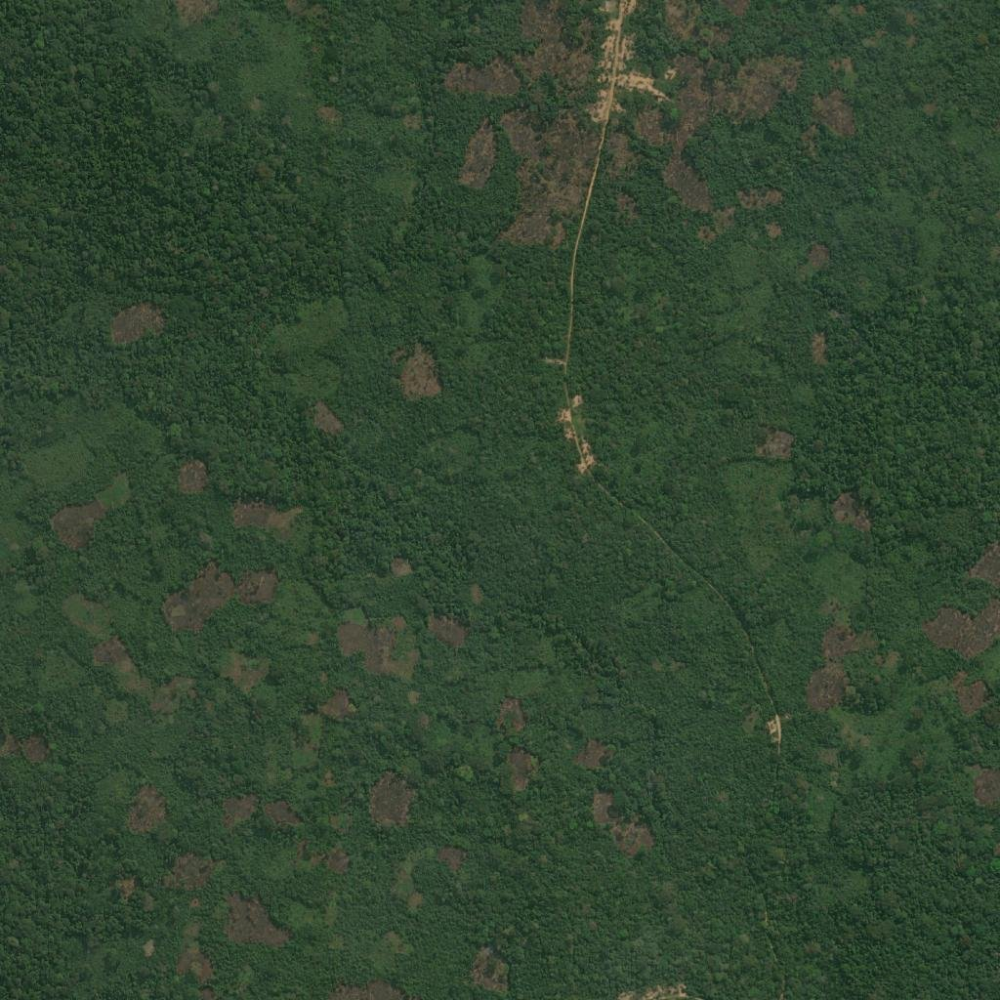
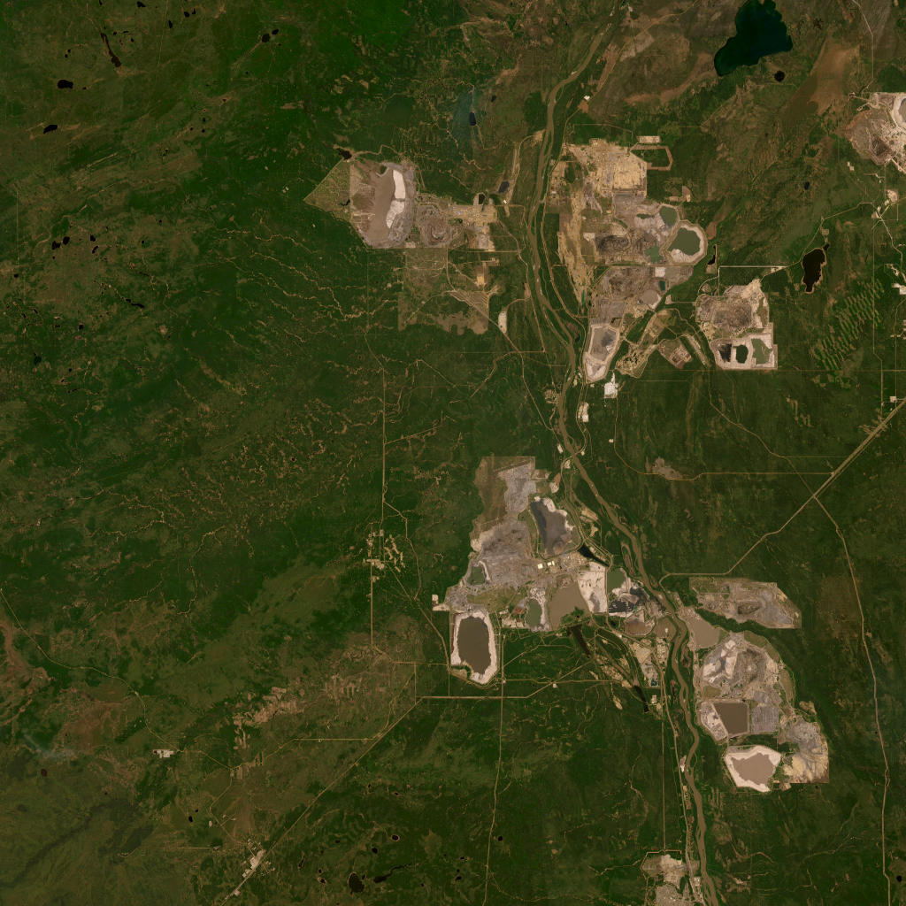

# Project Okavango - Group E

Welcome to the Okavango Hackathon project repository for Group E! 

This project provides a lightweight, interactive data analysis tool for environmental protection. It automatically fetches the most recent global environmental datasets, merges them with geographical data, and presents them in an interactive dashboard.

## Group Members
* Ruben Vetter: 70844@novasbe.pt
* Luca Isaak: 70197@novasbe.pt
* Lennart Stenzel: 70485@novasbe.pt

---

## 1. How to start using your code 
**(Installation & Usage)**

To run this project, you will need Python installed on your machine along with a few key data science libraries.

**Step 1: Clone the repository**
```bash
git clone [https://github.com/lucaIsaak/Group_E.git](https://github.com/lucaIsaak/Group_E.git)
cd Group_E
```

**Step 2: Install the required dependencies**
*(Assuming you have a virtual environment activated)*
```bash
pip install streamlit pandas geopandas pydantic requests pytest matplotlib
```

**Step 3: Run the application**
We use Streamlit for our front-end application. To launch the dashboard, run the following command from the root of the project:
```bash
streamlit run apps/main_app.py
```
*Example Usage:* Once the browser window opens, use the dropdown menu at the top to select a dataset (e.g., "Annual change in forest area"). The app will automatically download the required data, extract the most recent year for each country, and display the choropleth map alongside the Top 5 and Bottom 5 countries.

---

## 2. How to use the app

The app has two pages, accessible via the navigation buttons at the top.

### World Map

This page gives you an interactive overview of global environmental data.

1. Use the **dataset dropdown** to choose which metric to display (e.g. Annual change in forest area, Share of land that is protected).
2. The **choropleth map** colours every country by its most recent available value for that metric — green for high, red for low.
3. Use the **region filter** to narrow the view to specific continents. The "Select all regions" and "Clear regions" buttons let you quickly reset the selection.
4. **Click any country** on the map to see its individual KPIs: the exact value and its rank within the currently filtered set. Click "Clear country" to deselect.
5. Below the map, **Top 5 and Bottom 5** horizontal bar charts highlight the best and worst performing countries for the selected metric.

### AI Workflow

This page lets you pick any location on Earth, fetch a satellite image of it, and run an AI-powered environmental risk assessment.

1. **Set coordinates** either by typing a latitude and longitude directly, or by clicking anywhere on the interactive satellite map — a red pin will mark your selection.
2. Adjust the **image zoom level** (1–18, higher = more detail) and **image resolution** using the controls below the map.
3. Click **Fetch Satellite Image** to download a tile from ESRI World Imagery for your chosen location.
4. Click **Analyse with AI** to run a two-step pipeline:
   - A vision model (`llava`) describes the terrain, vegetation, water bodies, and structures visible in the image.
   - A text model (`llama3.2`) then asks targeted environmental risk questions based on that description and returns a verdict: **AT RISK**, **NOT AT RISK**, or **UNCERTAIN**.
5. The verdict is displayed as a colour-coded banner below the assessment.

> **Note:** Both models run locally via [Ollama](https://ollama.com/). If a model is not yet downloaded on your machine, it will be pulled automatically on first use — this may take a few minutes. Results are cached in `database/images.csv`, so re-running the same location skips the pipeline and loads instantly.

---

## 3. What our modules and functions are doing
**(Architecture & Logic)**

We chose to separate our data processing logic from our UI logic to keep the codebase clean, modular, and easy to debug. All data calls are validated using `pydantic` strict typing.

### `main.py` (Data Engine)
This module handles all the heavy lifting for data ingestion and manipulation.
* `download_project_datasets(datasets)`: Downloads the required CSVs from *Our World in Data* and the shapefile from *Natural Earth* into a local `/downloads` directory.
* `merge_map_with_datasets(world_map, datasets)`: Merges the tabular data with the spatial GeoDataFrame. Crucially, it uses Pandas `idxmax()` logic to dynamically find and filter for the **most recent data available** per country, ensuring no years are hardcoded.
* `OkavangoData` (Class): The central data handler. Upon initialization, it triggers the downloads, reads the CSVs into dynamic attributes, loads the world map, and executes the merge.

### `apps/main_app.py` (Streamlit Dashboard)
This module contains the front-end code. 
* It initializes `OkavangoData` using `@st.cache_resource` so the data isn't re-downloaded every time the user clicks a button. 
* It maps the selected dropdown options to the correct underlying DataFrame columns and uses `matplotlib` to render the maps and the Top/Bottom 5 bar charts.

---

## 4. The expected results and how you test your code
**(Testing & Workflow)**

### Expected Results
When running the application, you should expect a web dashboard that successfully displays a global map colored by the selected metric (e.g., Share of land that is protected). Below the map, you will see two horizontal bar charts highlighting the 5 countries with the highest values (green) and the 5 with the lowest values (red). The data displayed will always represent the latest available year for each specific country.

### How to Test
We have included a test suite using `pytest` to ensure the core data logic is robust and to help others debug the workflow. 

To run the tests, simply execute the following command in the root directory:
```bash
pytest tests/
```

**What the tests cover (`tests/test_main.py`):**
1.  **Network/Download Logic:** Verifies that `download_project_datasets` can successfully reach out to the internet, download a CSV file, and save it to the local disk.
2.  **Merge & Temporal Logic:** Creates dummy spatial and tabular data (with multiple years of data for a single country) to verify that `merge_map_with_datasets` successfully joins the dataframes *and* correctly isolates the most recent year.

---

## 5. Project Okavango and the UN Sustainable Development Goals

Project Okavango was built around a simple but urgent question: where on Earth are ecosystems under threat, and can we detect that threat from space? This question sits at the heart of several of the United Nations' Sustainable Development Goals, and we believe this tool, even in its current proof-of-concept form, offers a meaningful contribution to the data infrastructure needed to pursue them.

The most direct connection is with **SDG 15: Life on Land**, which calls for the protection, restoration, and sustainable use of terrestrial ecosystems, the halting of deforestation, and the reversal of land degradation. Our World Map page visualises exactly the datasets that measure progress against this goal: annual forest loss, the share of land that is protected, the share that is degraded, and the Red List Index tracking biodiversity decline. By surfacing the most recent data for every country and highlighting the best and worst performers, the tool makes global disparities in land stewardship immediately visible to anyone without specialist knowledge.

There is also a strong link to **SDG 13: Climate Action**. Forests are the world's most important carbon sinks, and land degradation accelerates greenhouse gas emissions. The AI Workflow page adds a forward-looking dimension: by letting a user point at any coordinate on Earth and receive an automated environmental risk assessment within minutes, it enables rapid triage of areas that may be experiencing unreported degradation. This kind of scalable, low-cost monitoring is precisely what is needed to complement slow-moving official reporting cycles.

Finally, the project touches on **SDG 2: Zero Hunger**. Land degradation — one of our tracked datasets — is directly linked to declining agricultural productivity, threatening food security for millions of people in arid and semi-arid regions. The AI pipeline's ability to detect bare earth, sparse vegetation, and arid conditions from satellite imagery means that degrading farmland can be flagged before it reaches a crisis point.

Taken together, Project Okavango demonstrates how freely available satellite data, open environmental datasets, and locally-run AI models can be combined into a monitoring tool that is transparent, reproducible, and accessible to anyone with a laptop. Scaled up and integrated with official reporting frameworks, a tool like this could meaningfully accelerate progress on Goals 2, 13, and 15.

---

### App Examples: Identifying Environmental Dangers

The following examples were generated using the live application. Each shows a satellite image, the AI-generated terrain description, and the final environmental risk verdict.

---

**Example 1 — Congo Basin, Democratic Republic of Congo (−2.46°N, 23.30°E, zoom 16)**

The Congo Basin contains the world's second-largest tropical rainforest and is one of the most biodiverse regions on Earth, home to forest elephants, bonobos, and thousands of plant species found nowhere else. It is also a critical global carbon sink. Despite its protected status in many areas, illegal logging and small-scale agricultural clearing are steadily fragmenting the canopy. At zoom 16, the boundary between intact forest and cleared land is clearly visible, with bare earth patches cutting into the green — a pattern consistent with advancing deforestation fronts.



> *AI Description:* Dense vegetation predominantly covering the landscape, with patches of bare earth possibly indicating areas of deforestation or clearance. Forested areas show varying shades of green, suggesting different vegetation types. No visible water bodies or urban structures.

> *Risk Assessment:*
> Q1: Is the area experiencing soil erosion due to deforestation or clearance? → **YES**: Patches of bare earth suggest active deforestation.
> Q2: Is there water pollution risk? → **NO**: No visible water bodies.
> Q3: Is habitat loss or fragmentation occurring? → **YES**: Bare earth patches amid otherwise dense forest indicate disturbance.

> **VERDICT: AT RISK** — The area shows signs of deforestation and potential habitat fragmentation, which could lead to soil erosion and loss of biodiversity.

---

**Example 2 — Athabasca Oil Sands, Alberta, Canada (57.00°N, −111.50°E, zoom 10)**

The Athabasca Oil Sands in northern Alberta represent one of the largest industrial projects in human history and one of the most visible examples of extractive industry destroying a living ecosystem. The oil sands sit beneath a vast expanse of boreal forest and peatland — ecosystems that are among the most carbon-dense and biodiverse in the temperate world, supporting caribou, migratory birds, and freshwater fish species. Open-pit mining strips away all vegetation down to bedrock across areas measured in square kilometres, replacing forest and wetland with tailings ponds filled with toxic by-products. From satellite at zoom 10, the area looks almost lunar: a grey and brown moonscape surrounded by the intact green of the forest it has consumed.



> *AI Description:* A highly disturbed industrial landscape. Large areas of stripped earth and exposed sediment surround what appear to be tailings ponds with dark, oily water. The terrain is almost entirely bare, with no natural vegetation remaining within the extraction zone. The surrounding area shows dense boreal forest, creating a sharp boundary between intact ecosystem and total destruction.

> *Risk Assessment:*
> Q1: Is the natural vegetation completely removed in the extraction zone? → **YES**: No vegetation visible within the industrial perimeter.
> Q2: Are there signs of toxic water contamination? → **YES**: Tailings ponds contain industrial by-products and show no signs of natural water.
> Q3: Is habitat loss total and ongoing? → **YES**: The scale of removal is industrial — entire ecosystems permanently replaced.

> **VERDICT: AT RISK** — Total and irreversible destruction of boreal peatland and forest ecosystem. One of the clearest examples of extractive industry-driven biodiversity loss visible from space.

---

**Example 3 — Aral Sea, Kazakhstan/Uzbekistan (44.50°N, 59.50°E, zoom 8)**

The Aral Sea was once the fourth-largest lake in the world, spanning over 68,000 km² and supporting a thriving fishing industry and rich aquatic ecosystem. Starting in the 1960s, Soviet irrigation projects diverted the two rivers feeding it to grow cotton in the surrounding desert. By the 2000s, the sea had lost over 90% of its volume, splitting into disconnected remnants surrounded by a salt flat known as the Aralkum — a newly created desert. The exposed lakebed is now toxic, laced with pesticide residue from decades of agricultural runoff, and regular dust storms carry that contaminated salt hundreds of kilometres across Central Asia. The fishing communities and the ecosystems that supported them are gone. At zoom 8, you can see the remaining water body as a pale shadow of what it once was, surrounded by the bleached, cracked remains of the former lakebed.


> *AI Description:* A largely dried lakebed. A small remnant water body is visible in the upper portion of the image, pale and shallow. The surrounding terrain is flat, white, and salt-encrusted with no vegetation. The absence of any transition zone between land and water suggests rapid and ongoing desiccation. No urban structures or healthy ecosystems visible.

> *Risk Assessment:*
> Q1: Is there evidence of severe and irreversible water loss? → **YES**: The near-total disappearance of the water body is clearly visible.
> Q2: Is the surrounding land contaminated or degraded? → **YES**: Salt and toxic residue from the dried lakebed is visible across the terrain.
> Q3: Can this area support biodiversity in its current state? → **NO**: No vegetation, no healthy water body, no habitat remaining.

> **VERDICT: AT RISK** — One of the worst human-caused environmental disasters in history. The complete collapse of a major water ecosystem due to agricultural overextraction, with no signs of recovery.

---
*License: MIT License*