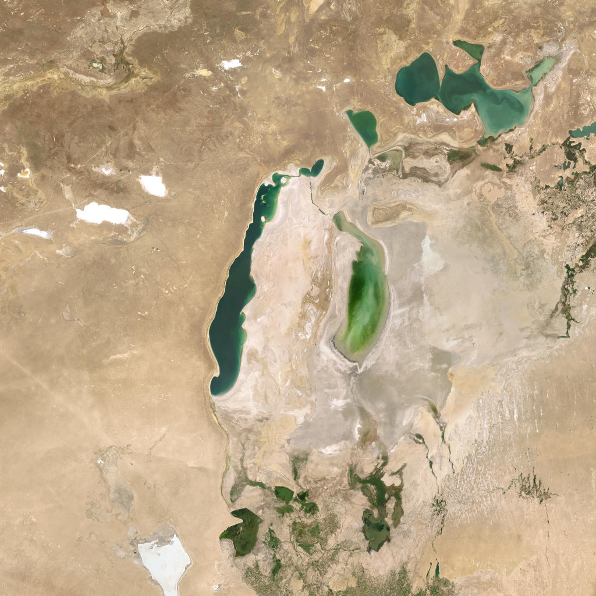

# Project Okavango - Group E

Welcome to the Okavango Hackathon project repository for Group E! 

This project provides a lightweight, interactive data analysis tool for environmental protection. It automatically fetches the most recent global environmental datasets, merges them with geographical data, and presents them in an interactive dashboard.

## Group Members
* Ruben Vetter: 70844@novasbe.pt
* Luca Isaak: 70197@novasbe.pt
* Lennart Stenzel: 70485@novasbe.pt

---

## 1. How to start using your code 
**(Installation & Usage)**

To run this project, you will need Python installed on your machine along with a few key data science libraries.

**Step 1: Clone the repository**
```bash
git clone https://github.com/lucaIsaak/Group_E.git         
cd Group_E
```

**Step 2: Install the required dependencies**
*(Assuming you have a virtual environment activated)*
```bash
pip install -r requirements.txt
```

**Step 3: Run the application**
We use Streamlit for our front-end application. To launch the dashboard, run the following command from the root of the project:
```bash
streamlit run apps/main_app.py
```

---

## 2. How to use the app

The app has two pages, accessible via the navigation buttons at the top.

### World Map

This page gives you an interactive overview of global environmental data.

1. Use the **dataset dropdown** to choose which metric to display (e.g. Annual change in forest area, Share of land that is protected).
2. The **choropleth map** colours every country by its most recent available value for that metric — green for high, red for low.
3. Use the **region filter** to narrow the view to specific continents. The "Select all regions" and "Clear regions" buttons let you quickly reset the selection.
4. **Click any country** on the map to see its individual KPIs: the exact value and its rank within the currently filtered set. Click "Clear country" to deselect.
5. Below the map, **Top 5 and Bottom 5** horizontal bar charts highlight the best and worst performing countries for the selected metric.

### AI Workflow

This page lets you pick any location on Earth, fetch a satellite image of it, and run an AI-powered environmental risk assessment.

1. **Set coordinates** either by typing a latitude and longitude directly, or by clicking anywhere on the interactive satellite map — a red pin will mark your selection.
2. Adjust the **image zoom level** (1–18, higher = more detail) and **image resolution** using the controls below the map.
3. Click **Fetch Satellite Image** to download a tile from ESRI World Imagery for your chosen location.
4. Click **Analyse with AI** to run a two-step pipeline:
   - A vision model (`llava`) describes the terrain, vegetation, water bodies, and structures visible in the image.
   - A text model (`llama3.2`) then asks targeted environmental risk questions based on that description and returns a verdict: **AT RISK**, **NOT AT RISK**, or **UNCERTAIN**.
5. The verdict is displayed as a colour-coded banner below the assessment.

> **Note:** Both models run locally via [Ollama](https://ollama.com/). If a model is not yet downloaded on your machine, it will be pulled automatically on first use — this may take a few minutes. Results are cached in `database/images.csv`, so re-running the same location skips the pipeline and loads instantly.

---

## 3. What our modules and functions are doing
**(Architecture & Logic)**

We chose to separate our data processing logic from our UI logic to keep the codebase clean, modular, and easy to debug. All data calls are validated using `pydantic` strict typing.

### `main.py` (Data Engine)
This module handles all the heavy lifting for data ingestion and manipulation.
* `download_project_datasets(datasets)`: Downloads the required CSVs from *Our World in Data* and the shapefile from *Natural Earth* into a local `/downloads` directory.
* `merge_map_with_datasets(world_map, datasets)`: Merges the tabular data with the spatial GeoDataFrame. Crucially, it uses Pandas `idxmax()` logic to dynamically find and filter for the **most recent data available** per country, ensuring no years are hardcoded.
* `OkavangoData` (Class): The central data handler. Upon initialization, it triggers the downloads, reads the CSVs into dynamic attributes, loads the world map, and executes the merge.

### `apps/main_app.py` (Streamlit Dashboard)
This module contains the front-end code. 
* It initializes `OkavangoData` using `@st.cache_resource` so the data isn't re-downloaded every time the user clicks a button. 
* It maps the selected dropdown options to the correct underlying DataFrame columns and uses `matplotlib` to render the maps and the Top/Bottom 5 bar charts.

---

## 4. The expected results and how you test your code
**(Testing & Workflow)**

### Expected Results
When running the application, you should expect a web dashboard that successfully displays a global map colored by the selected metric (e.g., Share of land that is protected). Below the map, you will see two horizontal bar charts highlighting the 5 countries with the highest values (green) and the 5 with the lowest values (red). The data displayed will always represent the latest available year for each specific country.

### How to Test
We have included a test suite using `pytest` to ensure the core data logic is robust and to help others debug the workflow. 

To run the tests, simply execute the following command in the root directory:
```bash
pytest tests/
```

**What the tests cover (`tests/test_main.py`):**
1.  **Network/Download Logic:** Verifies that `download_project_datasets` can successfully reach out to the internet, download a CSV file, and save it to the local disk.
2.  **Merge & Temporal Logic:** Creates dummy spatial and tabular data (with multiple years of data for a single country) to verify that `merge_map_with_datasets` successfully joins the dataframes *and* correctly isolates the most recent year.

---

## 5. Project Okavango and the UN Sustainable Development Goals

Project Okavango was built around a simple but urgent question: where on Earth are ecosystems under threat, and can we detect that threat from space? This question sits at the heart of several of the United Nations' Sustainable Development Goals, and we believe this tool, even in its current proof-of-concept form, offers a meaningful contribution to the data infrastructure needed to pursue them.

The most direct connection is with **SDG 15: Life on Land**, which calls for the protection, restoration, and sustainable use of terrestrial ecosystems, the halting of deforestation, and the reversal of land degradation. Our World Map page visualises exactly the datasets that measure progress against this goal: annual forest loss, the share of land that is protected, the share that is degraded, and the Red List Index tracking biodiversity decline. By surfacing the most recent data for every country and highlighting the best and worst performers, the tool makes global disparities in land stewardship immediately visible to anyone without specialist knowledge.

There is also a strong link to **SDG 13: Climate Action**. Forests are the world's most important carbon sinks, and land degradation accelerates greenhouse gas emissions. The AI Workflow page adds a forward-looking dimension: by letting a user point at any coordinate on Earth and receive an automated environmental risk assessment within minutes, it enables rapid triage of areas that may be experiencing unreported degradation. This kind of scalable, low-cost monitoring is precisely what is needed to complement slow-moving official reporting cycles.

Finally, the project touches on **SDG 2: Zero Hunger**. Land degradation — one of our tracked datasets — is directly linked to declining agricultural productivity, threatening food security for millions of people in arid and semi-arid regions. The AI pipeline's ability to detect bare earth, sparse vegetation, and arid conditions from satellite imagery means that degrading farmland can be flagged before it reaches a crisis point.

Taken together, Project Okavango demonstrates how freely available satellite data, open environmental datasets, and locally-run AI models can be combined into a monitoring tool that is transparent, reproducible, and accessible to anyone with a laptop. Scaled up and integrated with official reporting frameworks, a tool like this could meaningfully accelerate progress on Goals 2, 13, and 15.

---

### App Examples: Identifying Environmental Dangers

The following examples were generated using the live application. Each shows a satellite image, the AI-generated terrain description, and the final environmental risk verdict.

---

**Example 1 — Congo Basin, Democratic Republic of Congo (−2.46°N, 23.30°E, zoom 16)**

The Congo Basin contains the world's second-largest tropical rainforest and is one of the most biodiverse regions on Earth, home to forest elephants, bonobos, and thousands of plant species found nowhere else. It is also a critical global carbon sink. Despite its protected status in many areas, illegal logging and small-scale agricultural clearing are steadily fragmenting the canopy. At zoom 16, the boundary between intact forest and cleared land is clearly visible, with bare earth patches cutting into the green, a pattern consistent with advancing deforestation fronts.


> *AI Description:* The image is a satellite view of a landscape, predominantly covered with dense vegetation. The terrain appears to be a mix of forested areas with varying shades of green, indicating different types of vegetation, and patches of bare earth, possibly indicating areas of deforestation or clearance. There are no visible water bodies or urban structures. The image is taken from a high angle, providing a broad view of the landscape. The vegetation is dense, with a pattern that suggests a natural, undisturbed environment. There are no distinct features that stand out as landmarks or points of interest. The image does not provide any information about the specific location or region.

*Risk Assessment:*

1 Is the area likely to be experiencing soil erosion due to deforestation or clearance? → YES: The presence of patches of bare earth suggests areas of deforestation or clearance, which can lead to soil erosion.

2 Is the area likely to be experiencing water pollution due to agricultural or industrial activities? → NO: There are no visible water bodies, and the image does not provide any information about human activities that could lead to water pollution.

3 Is the area likely to be experiencing habitat loss or fragmentation due to human activities? → YES: The dense vegetation and natural pattern suggest a natural, undisturbed environment, but the presence of patches of bare earth and the lack of distinct features as landmarks or points of interest may indicate some level of disturbance or fragmentation.

4 Is the area likely to be experiencing climate change impacts, such as changes in temperature or precipitation patterns? → NO: There is no information provided about climate change impacts, and the image does not suggest any changes in the environment that could be attributed to climate change.

> **VERDICT: AT RISK** — SUMMARY: The area appears to be at risk due to deforestation or clearance, which could lead to soil erosion and potentially disrupt the natural habitat. However, the lack of information about human activities, water bodies, or climate change impacts makes it difficult to assess the full extent of the environmental risks.

---

**Example 2 — Athabasca Oil Sands, Alberta, Canada (57.00°N, −111.50°E, zoom 10)**

The Athabasca Oil Sands in northern Alberta represent one of the largest industrial projects in human history and one of the most visible examples of extractive industry destroying a living ecosystem. The oil sands sit beneath a vast expanse of boreal forest and peatland, ecosystems that are among the most carbon-dense and biodiverse in the temperate world, supporting caribou, migratory birds, and freshwater fish species. Open-pit mining strips away all vegetation down to bedrock across areas measured in square kilometres, replacing forest and wetland with tailings ponds filled with toxic by-products. From satellite at zoom 10, the area looks almost lunar: a grey and brown moonscape surrounded by the intact green of the forest it has consumed.


> *AI Description:* The image is a satellite view of a landscape, showcasing a mix of natural and human-made features. The terrain appears to be a blend of forested areas and open land, with a variety of vegetation, including what seems to be a dense canopy of trees in the lower right quadrant. There are also patches of bare land, possibly indicating deforestation or clearance for development.
Several water bodies are visible, including a large body of water in the upper left quadrant, which could be a lake or a river. There are also smaller bodies of water scattered throughout the landscape.
Urban structures are present in the form of a grid-like pattern of roads or pathways, with some buildings or structures visible, particularly in the lower right quadrant. These structures are surrounded by a mix of vegetation and open land, suggesting a rural or semi-rural setting.
The image also shows a few notable features such as a large, open area in the lower left quadrant that could be a mining site or a large clearing, and a few smaller, circular structures that might be storage tanks or ponds. The overall impression is of a landscape that is undergoing development, with a balance of natural and human-made elements.

*Risk Assessment:*

1 Is there a visible risk of deforestation or land degradation in the area? → YES: The presence of patches of bare land, possibly indicating deforestation or clearance for development, suggests a risk of land degradation.

2 Are there any visible water bodies that could be contaminated or affected by human activities? → UNCERTAIN: While the description mentions several water bodies, it does not provide information on their current water quality or potential contamination sources.

3 Are there any visible signs of mining or extractive activities in the area? → YES: The large, open area in the lower left quadrant could be a mining site or a large clearing, suggesting a potential risk of environmental contamination.

4 Are there any visible signs of urban or industrial activities that could pose a risk to local ecosystems? → YES: The grid-like pattern of roads or pathways, buildings or structures, and storage tanks or ponds suggest a presence of urban or industrial activities that could impact local ecosystems.

5 Is there a visible risk of flooding or water pollution in the area? → UNCERTAIN: While the description mentions several water bodies, it does not provide information on their current water levels, flow rates, or potential sources of pollution.

> **VERDICT: AT RISK** — SUMMARY: The area appears to be undergoing development, with visible signs of deforestation, mining, and urban or industrial activities that could pose risks to local ecosystems.

---

**Example 3 — Aral Sea, Kazakhstan/Uzbekistan (44.50°N, 59.50°E, zoom 8)**

The Aral Sea was once the fourth-largest lake in the world, spanning over 68,000 km² and supporting a thriving fishing industry and rich aquatic ecosystem. Starting in the 1960s, Soviet irrigation projects diverted the two rivers feeding it to grow cotton in the surrounding desert. By the 2000s, the sea had lost over 90% of its volume, splitting into disconnected remnants surrounded by a salt flat known as the Aralkum, a newly created desert. The exposed lakebed is now toxic, laced with pesticide residue from decades of agricultural runoff, and regular dust storms carry that contaminated salt hundreds of kilometres across Central Asia. The fishing communities and the ecosystems that supported them are gone. At zoom 8, you can see the remaining water body as a pale shadow of what it once was, surrounded by the bleached, cracked remains of the former lakebed.



> *AI Description:* The image is a satellite view of a desert landscape. The terrain is predominantly arid with sparse vegetation, primarily in the lower right corner. There are several water bodies scattered throughout the image, including a large body of water in the center and smaller bodies of water in the upper left and lower right corners. The water bodies appear to be lakes or oases. There are no urban structures visible in the image. The overall color palette is dominated by shades of brown and green, indicative of the desert environment and sparse vegetation.

*Risk Assessment:*

1 What is the primary environmental risk associated with the presence of water bodies in the desert landscape? → YES: The presence of water bodies, such as lakes or oases, in a desert landscape increases the risk of water pollution, as runoff from these bodies can carry pollutants and nutrients into nearby water sources, potentially harming aquatic life.

2 Is the risk of water pollution exacerbated by the presence of sparse vegetation in the lower right corner of the image? → YES: The sparse vegetation in the lower right corner may contribute to increased runoff and erosion, which can carry pollutants into water bodies, exacerbating the risk of water pollution.

3 Are there any potential sources of pollution or contamination in the image that could pose an environmental risk? → NO: There is no information in the description to suggest any potential sources of pollution or contamination, such as industrial activities, agricultural runoff, or waste disposal.

4 Is the risk of water scarcity or drought in the area indicated by the presence of water bodies? → YES: The presence of water bodies, such as lakes or oases, in a desert landscape suggests that the area may be experiencing or experiencing periodic water scarcity or drought, as these features are often formed in response to water availability.

> **VERDICT: AT RISK** — SUMMARY: The presence of water bodies in the desert landscape indicates a risk of water pollution and water scarcity or drought, highlighting the need for careful management and conservation of this valuable resource.

---
*License: MIT License*